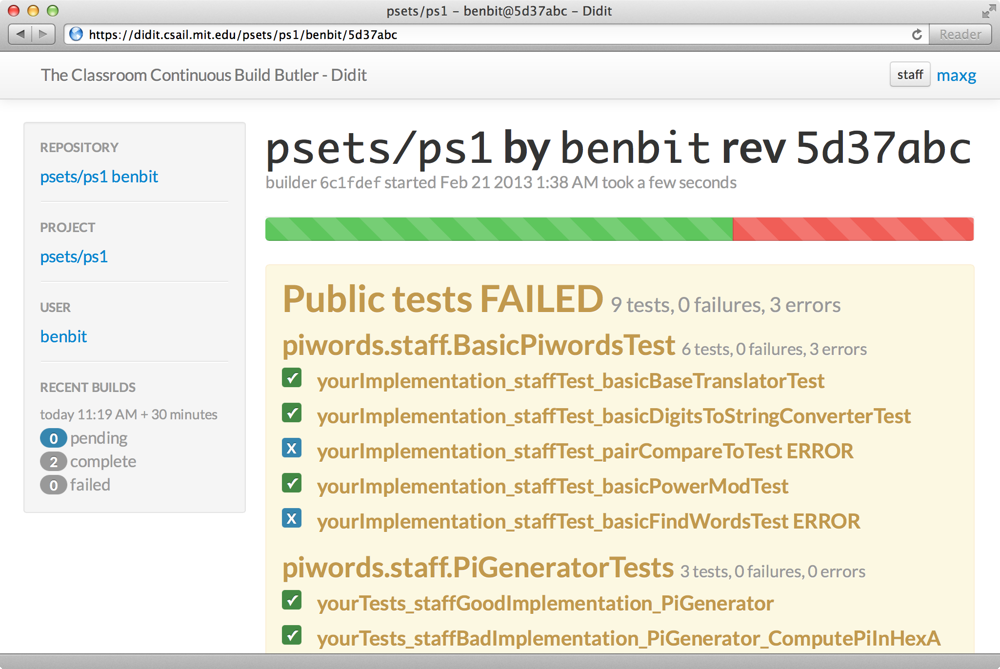

# Introduction

Didit is a continuous build system for the classroom.

+ Didit is integrated with student [Git] repositories.
  When students push new commits to their repository, Didit attempts to build and test their work.

+ Didit can provide students with quick and easily-accessible feedback on whether their work compiles and passes a suite of public tests.

+ Didit can run a suite of hidden tests, compute grades based on the results of those tests, and serve grade reports to students.

+ Didit allows staff to record student revisions at multiple deadline times and release grades using different deadlines for different students, to handle slack days or extensions.

## Moving parts

**Staff Git repository**: Didit assumes that a *staff repository* stores building and grading material for each assignment.
The staff repository must be organized with a required directory structure.

**Student Git repositories**: Each student has a *student repository* for each assignment.
Student repositories must be organized in a required directory structure.

**Shared filesystem**: Didit requires a *shared filesystem* for accessing student and staff repositories and for storing build results.

**Assignments**: an *assignment* has a two-part name so assignments of the same kind can be grouped together: `psets/ps0`, `projects/abcplayer`, etc.

**Build**: a *build* is an attempt to compile and run tests against a student submission for a particular assignment using a particular staff revision.
See **[builds]**, and **[build configuration]**, and **[build security]**.

**Staff revision, builder revision**: when it builds an assignment, Didit computes the latest revision of the staff repo that modified material for that assignment; this revision is the *staff revision* for the build.

**Public and hidden tests**: in addition to compilation results, *public test* results are visible to students, including stack traces and console output.
*Hidden test* results are only visible to staff.

**Sweep**: *Sweeping* an assignment causes Didit to (1) record the current revision for every student repo and (2) ensure that all of those revisions have been built with the current builder revision.
See **[sweeps]**.

**Milestone**: A *milestone* collects grades, assigned individually by revision or in bulk from a sweep, and allows grade reports to be released to students.
Milestones are named, e.g. "beta" and "final."

**Grade report**: A *grade report* shows the results of all tests specified in the grading configuartion for an assignment.
Grade reports are visible to students when released under a milestone.
See **[grade assignment]**.

**Amazon Simple Workflow Service**: Didit uses the [AWS Simple Workflow Service](http://aws.amazon.com/swf/) to queue and coordinate builds.

**Web font-end**: The *web front-end* serves web pages, handles build requests, and manages the build workflow by sending tasks to SWF.

**Workers**: *Workers* receive SWF tasks and perform builds: compiling, testing, and grading.

[Git]: http://git-scm.com/
[builds]: builds-and-sweeps.html#builds
[build configuration]: build-config.html
[build security]: build-security.html
[sweeps]: builds-and-sweeps.html#sweeps
[grade assignment]: grade-assignment.html
